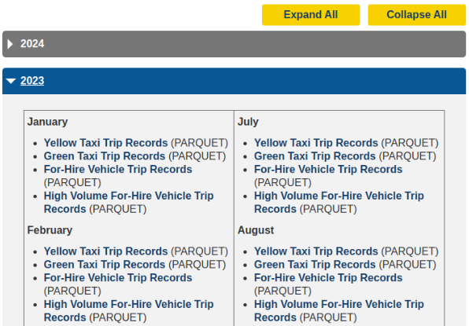
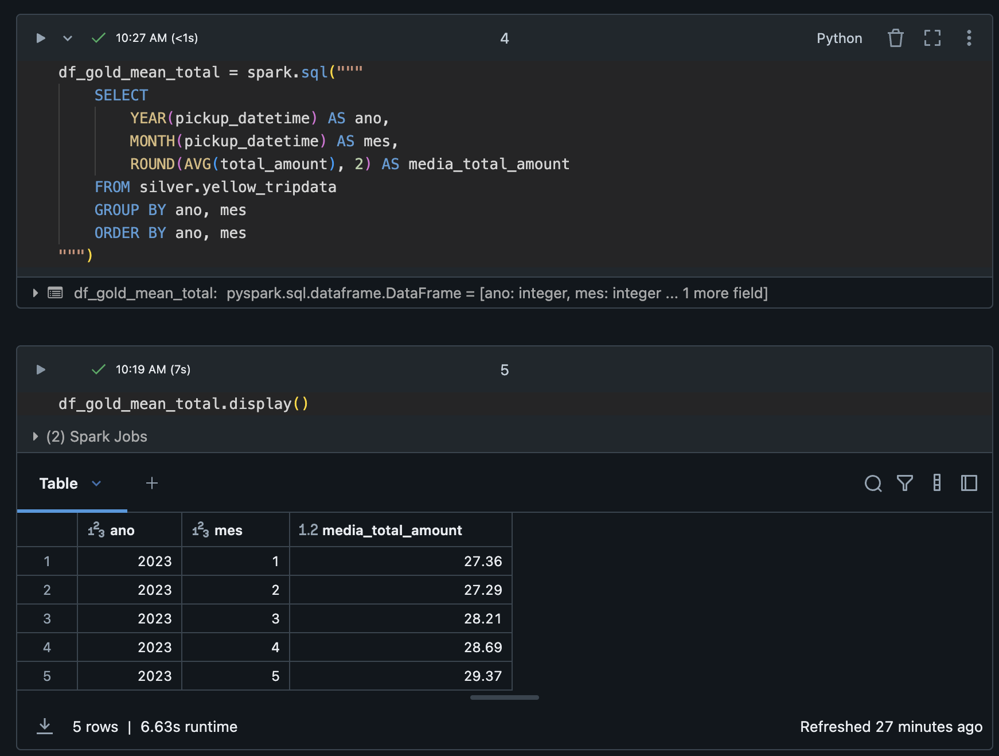

# Case Técnico Data Architect - iFood

## Objetivo

Esse desafio permitirá que você demonstre suas habilidades em Engenharia de Dados/Software, Análise e Modelagem de Dados.

Neste case técnico, você deverá fazer a ingestão de alguns dados em nosso Data Lake e pensar em uma forma de disponibilizá-los para os consumidores. Para finalizar, você deverá realizar análises sobre os dados disponibilizados.

Você deverá:

- Desenvolver uma solução para fazer a ingestão de dados referentes às corridas de táxis de NY em nosso Data Lake;
- Disponibilizar os dados para os usuários consumirem (através de SQL, por exemplo);
- Realizar algumas análises dos dados e mostrar os resultados;

## Dados Disponíveis
Os dados estão disponíveis no site da agência responsável por licenciar e regular os táxis na cidade de NY: https://www.nyc.gov/site/tlc/about/tlc-trip-record-data.page

Num primeiro momento, precisamos que sejam armazenados e disponibilizados os dados de Janeiro a Maio de 2023.



## Considerações
- Você pode considerar inicialmente armazenar todos os arquivos originais em uma landing zone (que pode ser um bucket do S3, por exemplo, ou qualquer outra tecnologia de sua escolha);
- Você pode considerar armazenar os dados estruturados/transformados em uma camada de consumo (que pode ser um bucket do S3, por exemplo, ou qualquer outra tecnologia de sua escolha);
- Você pode considerar manipular/limpar os dados que julgar necessário;
- Você precisa garantir que os dados das colunas **VendorID**, **passenger_count**, **total_amount**, **tpep_pickup_datetime** e **tpep_dropoff_datetime** estejam presentes na camada de consumo.
- Você pode considerar que no Data Lake não existe nenhuma tabela criada, portanto, precisam ser modeladas e criadas.


## O Desafio
Você deverá entregar:

1. **Solução para ler os dados originais, fazer a ingestão no Data Lake e disponibilizar para os usuários finais:**
- Deve utilizar PySpark em alguma etapa;
- Recomendamos usar Databricks Community Edition (https://community.cloud.databricks.com/);
- A escolha da tecnologia de metadados fica a seu critério;
- A escolha da linguagem de consulta (SQL, PySpark e etc) para os usuários finais fica a seu critério;

2. **Código SQL ou PySpark estruturado da forma que preferir com as respostas para as seguintes perguntas:**
- Qual a média de valor total (total_amount) recebido em um mês considerando todos os yellow táxis da frota?
- Qual a média de passageiros (passenger_count) por cada hora do dia que pegaram táxi no mês de maio considerando todos os táxis da frota?


## Estrutura do Repositório

```
ifood-case/
├─ src/          # Código fonte da solução
├─ analysis/   # Scripts/Notebooks com as repostas das perguntas
├─ README.md
└─ requirements.txt
```

## Critérios de Avaliação
Serão avaliados:
- Qualidade e organização do código
- Processo de análise exploratória
- Justificativa das escolhas técnicas
- Criatividade na solução proposta
- Clareza na comunicação dos resultados

## Instruções de Entrega
1. Crie um repositório público ou privado no GitHub
2. Desenvolva sua solução
3. Atualize o README com instruções de execução
4. Envie o link do seu repositório

## Dúvidas
Em caso de dúvidas sobre o desafio, abra uma issue neste repositório.

Boa sorte!

---

# Case Técnico Data Architect - iFood

## Solução Completa de Ingestão, Modelagem e Análise dos Dados de Táxis NY

---

## Sumário

* [Visão Geral do Case](#visão-geral-do-case)
* [Arquitetura da Solução](#arquitetura-da-solução)
* [Fluxo de Processamento](#fluxo-de-processamento)
* [Decisões Técnicas](#decisões-técnicas)
* [Detalhamento das Camadas](#detalhamento-das-camadas)
* [Análises Realizadas](#análises-realizadas)
* [Como Executar](#como-executar)
* [Referências](#referências)

---

## Visão Geral do Case

Oi, pessoal! 

**Resumo dos passos:**

* Ingestão dos dados de corridas de táxis de NY (2023-01 a 2023-05) disponibilizados pela NYC TLC.
* Organização das zonas: Landing Zone (raw), Bronze (dados brutos unificados), Silver (dados tratados e limpos), Gold (agregações e datasets prontos para consumo).
* Modelagem das tabelas, tratamento de esquemas distintos e padronização.
* Análises exploratórias e entregáveis em SQL/PySpark.

---

## Arquitetura da Solução

```plaintext
┌─────────────┐
│  Landing    │ [S3/DBFS/Parquet] <- Download manual dos arquivos (/FileStore/tables/landing_zone/  yellow_tripdata)
└────┬────────┘
     │
┌────▼──────┐
│  Bronze   │ [Delta Lake] Dados brutos unificados, por tipo (yellow, green, fhv, fhvhv)
└────┬──────┘
     │
┌────▼──────┐
│  Silver   │   [Delta Lake] Dados tratados, limpos, padronizados, prontos para análise
└────┬──────┘
     │
┌────▼──────┐
│   Gold    │   [Delta Lake] Agregações, KPIs e tabelas de consumo para BI/Analytics
└───────────┘
```


* **Ferramentas:** Databricks Community Edition, PySpark, Delta Lake, SQL.
* **Organização:** Cada camada é salva em um schema (database) próprio, e os dados são acessíveis via SQL e notebooks PySpark.
* **Notebooks separados** para cada etapa do pipeline (bronze, silver, gold, análise).

---

## Fluxo de Processamento

1. **Ingestão:**

   * Download manual dos arquivos Parquet para a Landing Zone no DBFS (`/FileStore/tables/landing_zone/yellow_tripdata/`).
2. **Bronze:**

   * Leitura e unificação dos arquivos de cada tipo.
   * Registro das tabelas Delta no schema `bronze`.
3. **Silver:**

   * Padronização de esquemas (colunas, tipos).
   * Limpeza (filtros de nulos, valores inconsistentes, cast de tipos).
   * Criação das tabelas finais no schema `silver`.
4. **Gold:**

   * possíveis agregações
   * Respostas às perguntas do case diretamente via SQL 

---

## Decisões Técnicas

* **Delta Lake:** escolhido para garantir versionamento, consistência, facilidade de atualização e leitura eficiente dos dados.
* **Schema Separation:** schemas distintos (`bronze`, `silver`, `gold`) facilitam governança, organização e rastreabilidade.
* **Padronização e limpeza:** função utilitária centraliza todas as transformações necessárias (casts, renomeações, filtros).
* **SQL para Consumo:** permite fácil integração com ferramentas de BI e facilita entendimento para o time.

---

## Detalhamento das Camadas

### Bronze

* Unificação dos arquivos por categoria.
* Apenas ingestão, sem transformações além da padronização de tipos necessários para evitar erros de união.

### Silver

* Limpeza: remoção de registros inválidos (nulos em colunas obrigatórias, valores negativos/impossíveis).
* Padronização de nomes (`VendorID` → `vendor_id`, e outros nomes em camelcase).
* Conversão de tipos (cast para `integer`, `double`, `timestamp`).
* Adição de colunas calculadas, como duração da corrida em horas.

### Gold

* Agregações: totais por mês, vendor, horas, etc.
* Análises requeridas no case

---

## Análises Realizadas

* **Pergunta 1:** Média de valor total (`total_amount`) recebido por mês, considerando todos os yellow táxis.

* **Pergunta 2:** Média de passageiros (`passenger_count`) por cada hora do dia no mês de maio.


## Como Executar

1. **Pré-requisitos:**

   * Conta no Databricks Community Edition
   * Upload dos arquivos Parquet para a landing zone do DBFS

2. **Execução:**

   * Execute os notebooks na ordem: `ingestion_bronze.ipynb` → `silver.ipynb` → `gold.ipynb` → `analysis.ipynb`
   * Siga as instruções e células documentadas.
   * Verifique os schemas criados e as tabelas em cada etapa.

---

## Referências

* [NYC TLC Trip Data](https://www.nyc.gov/site/tlc/about/tlc-trip-record-data.page)

---

### Muito obrigada!
